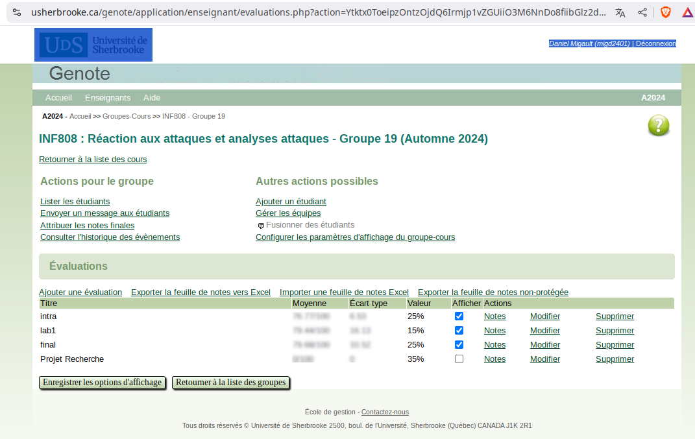
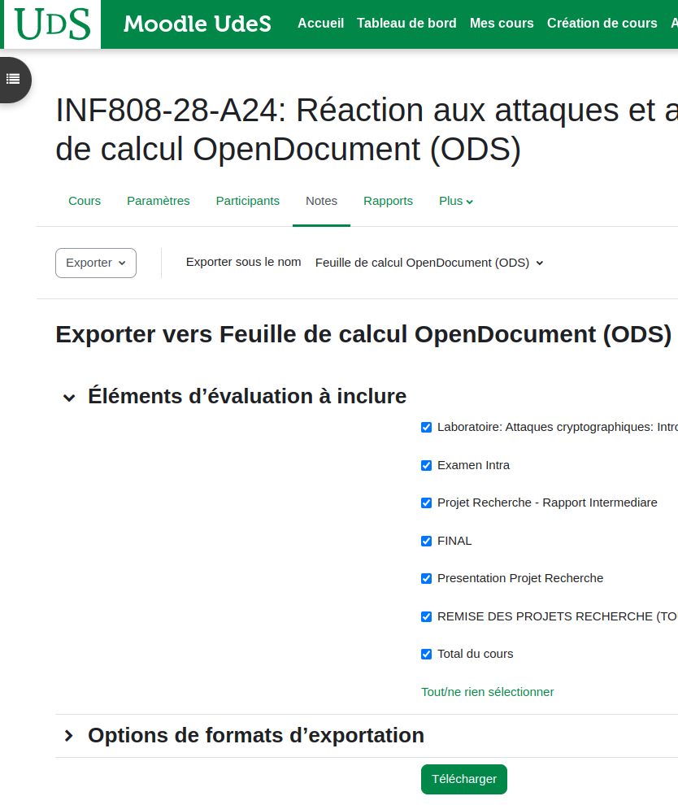
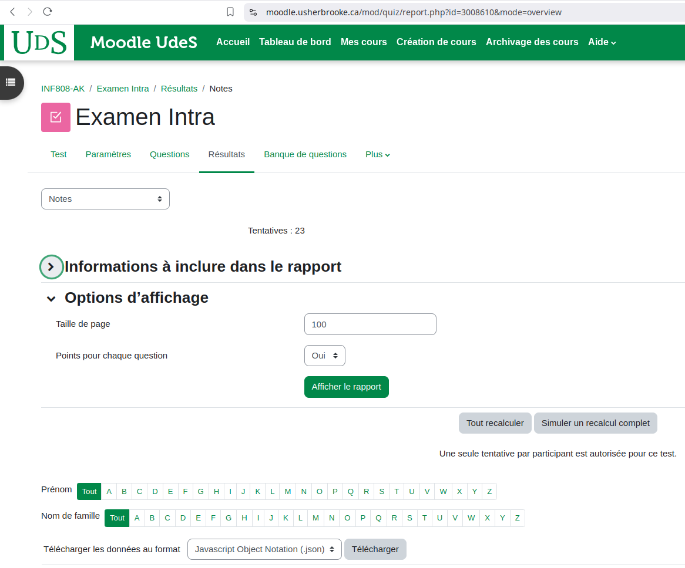
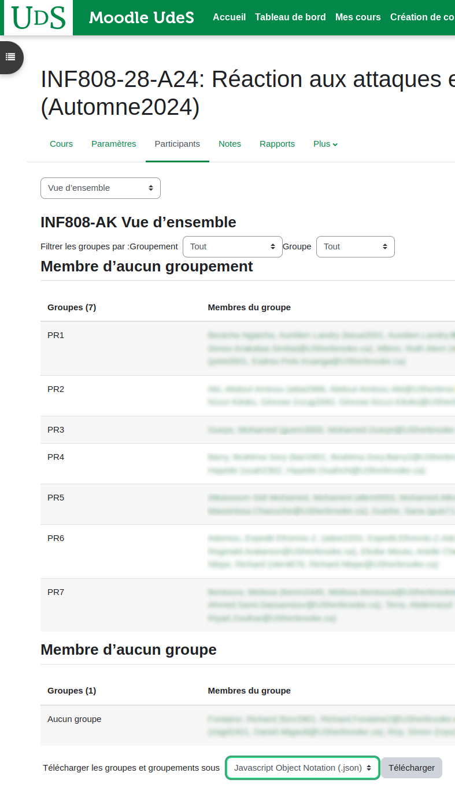
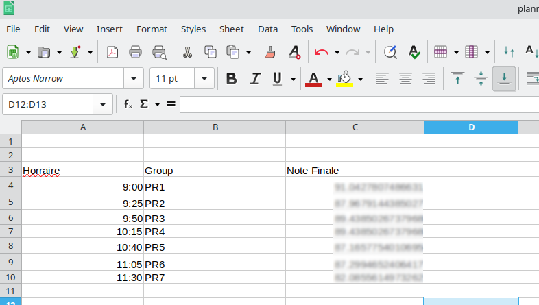

 

lab_eval  evaluate python scripts submitted by student. 
The use case is as follows: 
Students have top complete a laboratory that includes python scripts. 
Each students submits the scripts and a report using (for example) moodle. 

This scripts takes the submission of the students and test automatically the scripts against those of the instructor. 
The evaluation results in a grade being assigned to each student as well as a log file that can be helpful to the student for debugging. 

# Installation

```bash
$ git clone 
$ cd lab_eval
$ python3 -m build && pip3 install --force-reinstall dist/lab_eval-0.0.<version>.tar.gz
```

# Usage Example

## Evaluating a single Lab

Evaluation of the caesar of the student

```bash
$ lab_eval_lab  --conf ~/gitlab/lab_eval/examples/lab_caesar.cfg \
      ./labs/Firstname,_Lastname_5698747_assignsubmission_file_
```
In order to specify the output log file (toto.log):
Note that we assume that the lab_caesar.cfg specifies that output is placed in a log file by specifying the `log_dir`. This variable is usually commented, in which case, either we should uncomment it or specify it in the command line using `--log_dir <log_dir>`.

```bash
$ lab_eval_lab  --conf ~/gitlab/lab_eval/examples/lab_caesar.cfg \
      --lab_id toto ./labs/Firstname,_Lastname_5698747_assignsubmission_file_
```
## Evaluation the class 

The configuration file is located in ~/gitlab/lab_eval/examples/lab_caesar.cfg and specifies the various locations of the necessary files:

* the instructir's python files (the solutions)
* the file that evaluates the student's scripts against the solutions lab_caesar.py
* the student database. The student data base is provided by moodle in "Participants" tab, "select all participants" export as JSON file.
* the labs submitted by the students "Consulted assignments" > "Download all assignments" - in our case  INF808-AI-Laboratoire1\ Attaques\ cryptographiques\ \(Remise\ des\ devoirs\)-2622297.zip


To run the evaluation from the Moodle Zip File


```
$ lab_eval_class  --conf ~/gitlab/lab_eval/examples/lab_caesar.cfg  \
      --class_dir lab1   INF808-AI-Laboratoire1-2622297.zip 
```

In general, we expect that some question are evaluated manually. This can occurs when the lab combines code evaluation as well as a report evaluation. Once the report has been evaluated and the associated scores placed into the `score_list.json` file, we recompute the grades to consider the manually added scores as follows:

```
$ lab_finalize_grades  --conf ~/gitlab/lab_eval/examples/lab_caesar.cfg \
      test_class_dir/score_list.json

```
## Adding to score_files

The evaluation of the class evaluates the python scripts and generates a file `score_list.json` file. In our case, in addition to the python scripts we are willing to evaluate the report of the lab - which is a PDF file. 
One way to do, is to edit the `score_list.json` file directly and add the grade associated to the report. 
Another way to proceed is to evaluate the PDF report in a separate score_list file `pdf_score_list.json`, and then combine the two files together. To do so we proceed as follows:

```
$ lab_add_score_list --conf ~/gitlab/lab_eval/examples/lab_caesar.cfg \
      score_list.json pdf_score_list.json 
```

## Generating the grades


```
$ lab_finalize_grades --conf ~/gitlab/lab_eval/examples/lab_caesar.cfg \
      score_list.json 
```

## Exporting Grades to Genote 

The University requires that grades be submitted via a specific application referred to as Genote. This application produces particular XLS template files (Genote XLS File) that must be completed and imported as illustrated in Fig 1 below.

<figure>
  
<figcaption>Fig 1. Genote interface to import or export Genote XLS Files</figcaption>
</figure>

The Genote XLS File represent the administrative grouping of students. However, this administrative framework does not accurately depict the organization of students during a session, nor does it align with the tools employed for student evaluation, such as Moodle or Lab Eval. The grades of students are exported in multiple formats, none of which are compatible with the Genote XLS File.

This section presents various scenarios in which grades are initially exported in a particular format and subsequently converted into a Genote XLS File.

### Importing Grades From a JSON Score List


The JSON Score List File serves as the native format for Lab Eval.

If `score_list.json` denotes the JSON Score List File, and `genote.xls` denotes the Genote XLS File, the importation process can be executed as follows:  

```
$ grade_to_genote --type 'score_list' score_list.json  genote.xls
```

#### Ex: INF808 Lab 

To import the Lab grades into Genote we type the following commands:

```
grade_to_genote --type 'score_list' score_list.json notes-INF808Gr28-A2024.xlsx 

Student_id and grades have been computed in notes-INF808Gr28-A2024--grades.xlsx. To finalize 
  the exportation to the Genote file, please:

    1. open the Genote file notes-INF808Gr28-A2024.xlsx
    2. open the newly created file: notes-INF808Gr28-A2024--grades.xlsx 
    3. copy the column from the newly created file to the Genote file.

```

### Importing Grades From a Moodle XLS Report File (for a single Exam)

A Moodle XLS Report File is an ODS or XLS file that has been exported from the Moodle platform, as illustrated in Fig 2. It is essential to emphasize that this discussion is limited to the situation where only one examination is selected.

<figure>
  
<figcaption>Fig 2. Moodle interface to export Moodle XLS Report Files</figcaption>
</figure>
 
If `grade_moodle_report.ods` denotes the Moodle XLS Report File, and `genote.xls` denotes the Genote XLS File, the importation process can be executed as follows:  

``` 
$ grade_to_genote --type 'moodle_xls_report' grade_moodle_report.ods  genote.xls
```

#### Ex: INF808 Intra / Final / Research Projects

To import the grades of the Intra, Final or Research Projects - or any exam evaluated via Moodle - into Genote we type the following commands:

```
$ grade_to_genote --type 'moodle_xls_report' INF808-AK\ Notes.ods \
      notes-INF808Gr28-A2024.xlsx 

Student_id and grades have been computed in notes-INF808Gr28-A2024--grades.xlsx. To finalize 
  the exportation to the Genote file, please:

    1. open the Genote file notes-INF808Gr28-A2024.xlsx
    2. open the newly created file: notes-INF808Gr28-A2024--grades.xlsx 
    3. copy the column from the newly created file to the Genote file.
```

### Importing Grades From a Moodle Exam File (With Questions)

The Moodle Exam File (with Questions) is exported on Moodle as illustrated in Fig 3. 

<figure>
  
<figcaption>Fig 3. Moodle interface to export Moodle XLS Exam Files</figcaption>
</figure>

If `grade_moodle_exam.json` denotes the Moodle JSON Exam File, and `genote.xls` denotes the Genote XLS File, the importation process can be executed as follows:  

``` 
$ grade_to_genote --type 'moodle_json_exam' grade_moodle_exam.json  genote.xls
```

#### Ex: INF808 Intra / Final 

To import the grades of the Intra, Final or Research Projects - or any exam evaluated via Moodle - into Genote we type the following commands:

```
$ grade_to_genote --type 'moodle_json_exam' INF808-AK-Examen\ Intra-notes.json \
      notes-INF808Gr28-A2024.xlsx 

Student_id and grades have been computed in notes-INF808Gr28-A2024--grades.xlsx. To finalize 
  the exportation to the Genote file, please:

    1. open the Genote file notes-INF808Gr28-A2024.xlsx
    2. open the newly created file: notes-INF808Gr28-A2024--grades.xlsx 
    3. copy the column from the newly created file to the Genote file.

```

###  Importing Grades From an XLS File with Group Grades

This section addresses the scenario in which students collaborate in groups. As illustrated in Fig 4, Moodle offers the functionality to form student groups and export these groups as a Moodle JSON Group File.

<figure>

<figcaption>Fig 4. Moodle interface to export Moodle JSON Group Files</figcaption>
</figure>

Moodle, on the other hand, does not offer the functionality to assign grades to groups. Instead, grades are allocated directly to individual students. In our scenario, as demonstrated in Fig 5, we utilize an XLS file to assign a specific grade to the group, as shown below. Given that the XLS file is specifically designed for this purpose, it is necessary to specify the relevant columns during the importation process to Genote.

<figure>

<figcaption>Fig 5. XLS Files containing the grades of the groups</figcaption>
</figure>


If `group_grade.xls` denotes the XLS File, `moodle_groups.json` denotes the Moodle JSON Group File, and `genote.xls` denotes the Genote XLS File, the importation process can be executed as follows:  

``` 
$ grade_to_genote.py --type 'xls_group' --moodle_json_group moodle_groups.json \
      --group_col 1 --grade_col 2 --row_header 2 --last_row 39 group_grade.xls \
       genote.xls

```

#### Ex: INF808 Research Projects

For the Research Projects, we applied the following commands:


``` 
$ grade_to_genote --type 'xls_group' --moodle_json_group ./INF808-AL_groups.json \
      --group_col 1 --grade_col 2 --row_header 2 --last_row 39 \
      ./Presentations_lundi.xlsx  ./notes-IFT511Gr1-A2024.xlsx
    WARN unable to find Grade or Group (Test) in XLS file for student migd2401
    WARN unable to find Grade or Group (Test) in XLS file for student roys2213
    WARN unable to find Grade or Group (Aucun groupe) in XLS file for student fonr2901
    WARN unable to find Grade or Group (Aucun groupe) in XLS file for student leey0501

Student_id and grades have been computed in notes-IFT511Gr1-A2024--grades.xlsx. To finalize 
  the exportation to the Genote file, please:

    1. open the Genote file notes-IFT511Gr1-A2024.xlsx
    2. open the newly created file: notes-IFT511Gr1-A2024--grades.xlsx 
    3. copy the column from the newly created file to the Genote file.

```
  
# Note Regarding Real Example

## lab_caesar

We download the scripts from moodle and run the evaluation. 

```
lab_eval_class  --conf ~/gitlab/lab_eval/examples/lab_caesar.cfg  --class_dir lab1   INF808-AI-Laboratoire1\ Attaques\ cryptographiques\ \(Remise\ des\ devoirs\)-2622297.zip
```

This creates a directory lab1 in which we can find the resulting evaluation `score_list.json`. However, we received some scripts via email. We currently cannot re-run the evaluation and the existing expanded zip file. The main reason is that if we enable this, it remains confusing what is re-evaluated, what is overwritten. As aresult, we need to build a new zip file. 
To do so, we place the up-todate scripts in the `lab1/lab` directory under the right student, selecte all student directories and compress them in zip file `moodle.zip` and re-run the evaluation.
```
lab_eval_class  --conf ~/gitlab/lab_eval/examples/lab_caesar.cfg  --class_dir lab1 moodle.zip 
```

The lab_caesar combines the evaluation of the scripts and a report. As a result, we have the evaluation of the report performed in `pdf_score_list.json` and the evaluation of the scripts in `lab1/score_list.json`. To combine these two score_list we add those of the report to those of the scripts with the following command line.
Note the added file is the second argument so `pdf_score_list.json`` will be added to `lab/score_list.json`.

```
lab_add_score_list --conf ~/gitlab/lab_eval/examples/lab_caesar.cfg lab1/score_list.json pdf_score_list.json
```

Note: We probably need to define a function that sets to None a list. This enables to initialize the pdf_score_list.json from score_list.json. 
We can also check that 'grade (total)' and 'grade(%)' have been updated.  

```
import json 
with open( 'pdf_score_list.json', 'rt', encoding='utf8' ) as f:
  l = json.loads( f.read( ) )
for k in l.keys() :
  for q in l[ k ].keys():
    try:
      int( q )
      l[ k ][ q ] = None
    except:
      continue
with open( 'pdf_score_list.json', 'wt', encoding='utf8' ) as f:
  f.write( json.dumps( l ),  indent=2 ) 
```


When original files have been saved, we can check `pdf_score_list.json` has not been modified while `lab1/score_list.json` has been modified. 


## Lab2 

We update directly the json file. In this case, we provides the points to anyone that has given a 'decent' report as most of the information was needed to execute the code. 
 
```
import json
with open( './score_list.json_script_report', 'rt', encoding='utf8' ) as f:
  scores = json.loads( f.read() )
  
  
for k in scores.keys():
  if k != "student_id_with_no_report":
    scores[ k ][ '2' ] = 1 
    scores[ k ][ '5' ] += 1
    scores[ k ][ '9' ] = 1 
  else: 
    scores[ k ][ '2' ] = 0
    scores[ k ][ '9' ] = 0

with open( './score_list.json_script_report', 'wt', encoding='utf8' ) as f:
  f.write( json.dumps( scores, indent=2 ) )
```

To update the grades:
```
lab_finalize_grades --conf ~/gitlab/lab_eval/examples/lab_babyesp.cfg score_list.json_script_report 
```

## Individual submissions

When one studnet missed the dead line, we may want to add its contributions individualy. One way to do so is to rebuild the moodle.zip file. 

If the evaluation has already run over moodle.zip, all files are unzipped under the lab1/cryptolab/moodle_dir directory. This means that we have:

```
lab1/cryptolab/moodle_dir/moodle_dir
  +- student_dir_start
  ...
  +- late_student_dir
  ...
  +- student_dir_end
``` 

When the files of the late student are updated, we run

```
cd lab1/cryptolab/moodle_dir/moodle_dir
zip -r "/home/mglt/uds/2024-fall-inf808/lundi/lab1/INF808-AL-Laboratoire Attaques cryptographiques Introduction aux attaques cryptographiques-3001267.zip"  .
```

# Configuration 

## Configuration file

Check the `lab_eval.git/examples/lab_caesar.cfg` as an example.

## StudentDB file


# Building the module to evaluate your own lab

please check `lab_eval.git/examples/lab_caesar.cfg` or `lab_eval.git/examples/lab_babyesp.cfg`


# Other links:

Here are some additional resources to push further the automation of Moodle labs assignaments:

https://github.com/troeger/moodleteacher
https://github.com/hexatester/moodlepy/blob/master/moodle/mod/assign/assignment.py

# TODO

* refine the necessary operations: between moodle / genote and labeval.
* max_score MUST always be provided when using finalize. In many cases, this value is taken from the Evalpy module. We may consider adding it as a metadata in score_list or in a conf file or as an argument to each command line. lab_finalize_grades lab_add_score_list. 
* column description for genote excel files may be part of a conf file. 
* initializations of scoreFile list needs to be revised   init_from_file needs a self. 

related to the moodle_file.py

TODO: 

1. We often create directly the ScoreList File with :

```    
  with open( score_list_path, 'w', encoding='utf8' ) as f:
      f.write( json.dumps( score_list, indent=2 ) )
```
It would be good to instantiate it via ScoreList and we need to be able to instantiates ScoreList this way. This also requires to revisit the way we instantiate ScoreList.

2. Moodle Exam File only takes the format with Questions. We need to see if that works with the other format.
3. We need to rethink the designation of modules and packages Eval_lab, Eval Class, Lab_Eval
4. Might be easier to use uid instead of student_id.
5. We might use a base class for XLS Files or Moodle Files.
6. Moodle float conversion from "," to "." may not be necessary.
7. It would be nice to have a NEW XLS Genote File being created, and intermediary files being generated in a temporary directory.   

